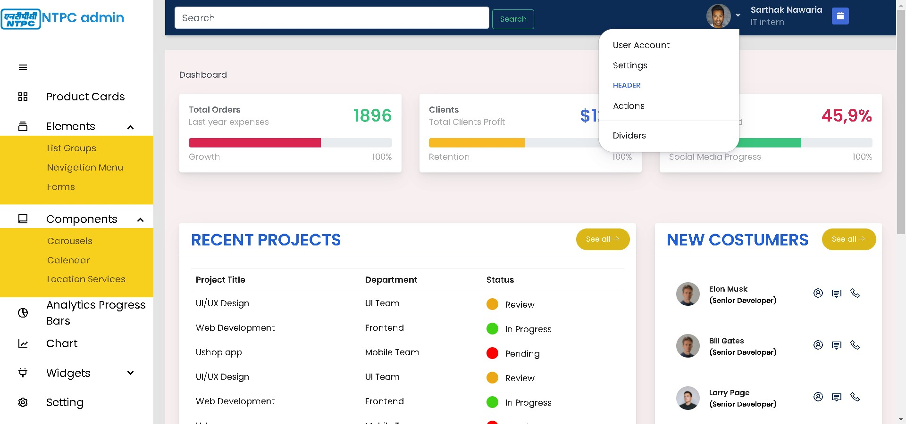
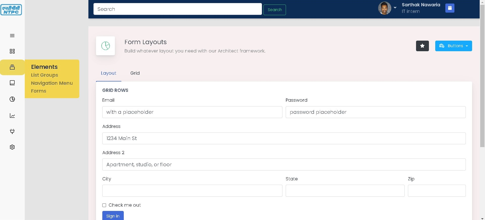

# ADMIN USER INTERFACE FOR TRAINING 

## This is only template and the front end part only does not have backend integration . 
## 1) It has different categories like 
                                    a)Product Cards
                                    b)Form Tab
                                    c)Carousel 
                                    d)Location tab 
## 2) The user can choose what component are required as per his requirements and remove the others .                                    
                                    
                                 
                                 
                                 
                                 
LANGUAGES USED :  HTML5 CSS3 Javascript CHART.js Bootstrap and more                                                                                        CODED on VISUAL STUDIO CODE

